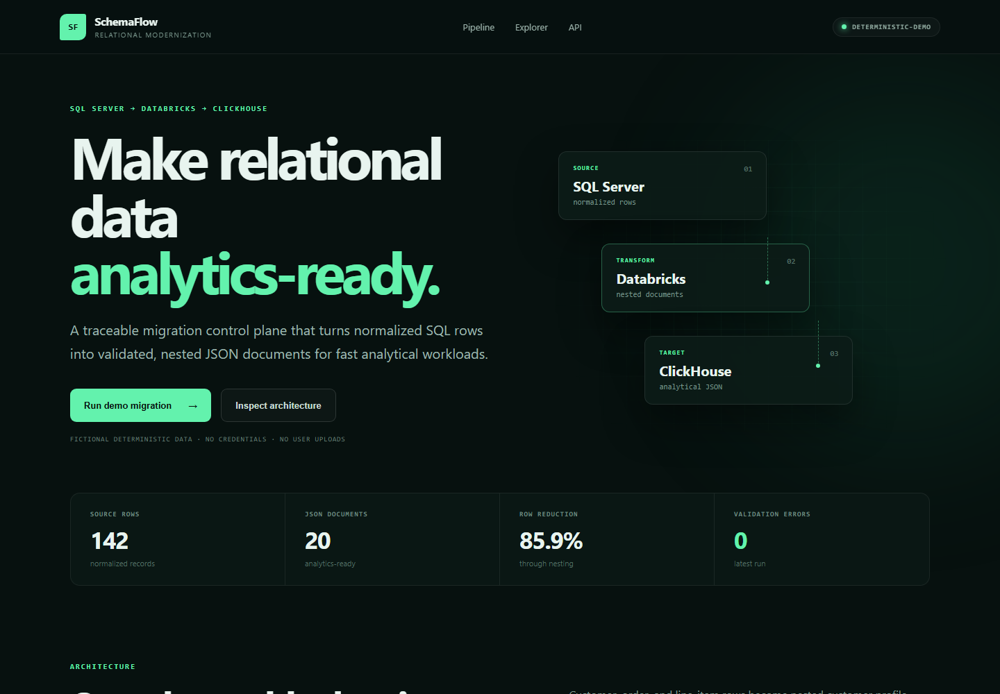
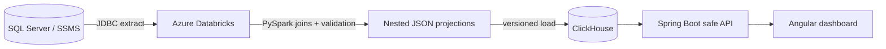

# SchemaFlow Platform

[](https://github.com/MontassarBenMesmia/schemaflow-platform/actions/workflows/ci.yml)
[](https://adoptium.net/)
[](https://spring.io/projects/spring-boot)
[](https://angular.dev/)
[](LICENSE)
[](https://schemaflow-platform.onrender.com)

An observable relational-to-JSON analytics modernization platform built around SQL Server, Azure Databricks, ClickHouse, Spring Boot, and Angular.

SchemaFlow demonstrates how normalized operational rows can become nested, lineage-aware analytical documents. It includes a safe public demo, a real ClickHouse adapter, a Databricks PySpark transformation, reproducible SQL schemas, CI, containers, health checks, and deployment configuration.

**Live application:** [schemaflow-platform.onrender.com](https://schemaflow-platform.onrender.com)



> ClickHouse is a column-oriented analytical SQL database—not a general-purpose NoSQL document store. This project deliberately uses JSON projections in ClickHouse for analytical search and aggregation while keeping SQL Server as the operational source of truth.

## What the user does

1. Opens the migration dashboard and reviews the five-stage architecture.
2. Runs a deterministic demo migration.
3. Sees normalized source-row counts reconciled against nested output documents.
4. Filters logical collections and searches the transformed JSON.
5. Inspects a read-only document and its relational lineage count.

The demo accepts no uploads and stores no user data.

## Pipeline



## Engineering highlights

- Deterministic, credential-free demo profile for public deployment
- Production-style ClickHouse HTTP adapter selected by Spring profile
- PySpark notebook using Databricks secret scopes instead of embedded credentials
- Explicit source/target migration contract and lineage counts
- Fixed, bounded API operations with no arbitrary SQL endpoint
- Security headers, validation, structured problem responses, and health probes
- Multi-stage Docker image serving Angular and Spring Boot from one origin
- Local ClickHouse integration stack with automated schema and sample loading
- Backend API tests, Angular tests/build, pipeline syntax checks, and container CI

## Quick start

### Public/demo mode

```bash
cd backend
mvn spring-boot:run
```

In another terminal:

```bash
cd frontend
npm ci
npm start
```

Open `http://localhost:4200`.

### ClickHouse integration mode

```bash
docker compose up --build
```

Open `http://localhost:8080`. See [deployment.md](docs/deployment.md) before enabling the optional SQL Server source profile.

## API

| Method | Endpoint | Purpose |
| --- | --- | --- |
| `GET` | `/api/v1/health` | Application health and version |
| `GET` | `/api/v1/dashboard` | Counts, reconciliation, collections, and runs |
| `GET` | `/api/v1/documents` | Bounded collection/search explorer |
| `GET` | `/api/v1/migrations` | Recent in-process demo runs |
| `POST` | `/api/v1/migrations/demo` | Replay the deterministic public demonstration |
| `GET` | `/api/v1/architecture` | Pipeline stages and safety controls |

Interactive OpenAPI documentation is available at `/api/docs`.

## Repository structure

```text
schemaflow-platform/
|-- backend/             Spring Boot API and tests
|-- frontend/            Angular dashboard
|-- databricks/          PySpark SQL Server-to-ClickHouse job
|-- infra/clickhouse/    Versioned target schema
|-- infra/sqlserver/     Fictional normalized source schema
|-- scripts/             Local deterministic loader
|-- docs/                Architecture, deployment, migration contract
|-- .github/             CI and dependency automation
|-- Dockerfile
`-- docker-compose.yml
```

## Documentation

- [Architecture and trust boundaries](docs/architecture.md)
- [Deployment guide](docs/deployment.md)
- [Migration contract and quality gates](docs/migration-contract.md)
- [Security policy](SECURITY.md)

## Provenance

SchemaFlow is a clean-room portfolio reconstruction of concepts explored during a summer internship. It contains no employer source code, customer data, internship reports, personal documents, screenshots, binaries, database exports, or original cloud credentials. All sample identities and records are fictional.

Developed and maintained by [Montassar Ben Mesmia](https://github.com/MontassarBenMesmia).
