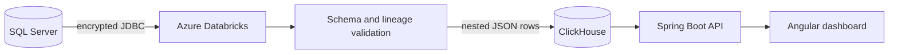

# Architecture

SchemaFlow demonstrates a controlled modernization path from normalized operational tables to nested analytical documents.

## Data model

The sample source has three normalized relations: `Customer`, `SalesOrder`, and `SalesOrderItem`. The PySpark job groups line items into orders and orders into a customer profile document. Each output retains a `source_row_count`, migration timestamp, and version so operators can reconcile the transformation.

ClickHouse is a column-oriented analytical SQL database, not a general-purpose document database. SchemaFlow stores nested JSON as an analytical projection because the target workload is search, aggregation, and migration inspection. The SQL Server system remains the operational source of truth.

## Runtime modes

- `demo` is the default and public deployment mode. It uses deterministic fictional data and requires no credentials or external services.
- `clickhouse` reads the versioned `schemaflow.json_documents` table through ClickHouse's HTTP interface. Credentials are supplied only through environment variables.
- The Databricks notebook performs the production-style SQL Server extraction and ClickHouse load using a Databricks secret scope.

## Trust boundaries

- Browser clients never receive database credentials.
- The API exposes fixed operations; arbitrary SQL and unrestricted mutation are intentionally absent.
- Search text and result sizes are bounded and server-validated.
- Databricks owns source/target secrets and cluster JDBC dependencies.
- The public demo stores no submitted data and accepts no uploads.
